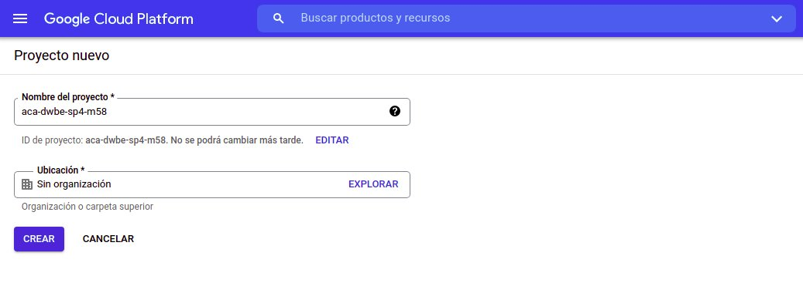
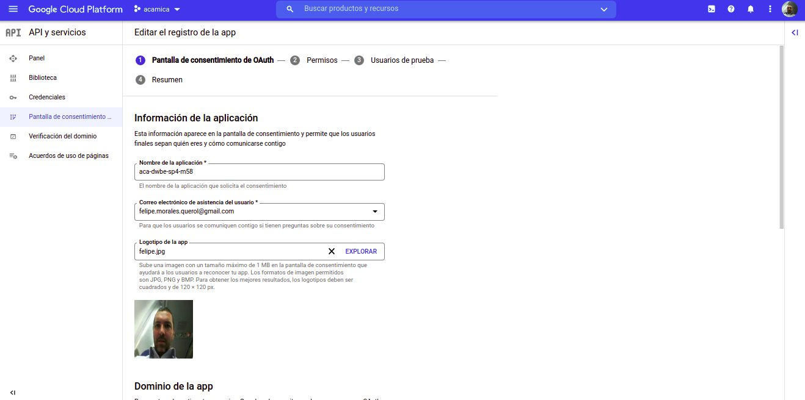
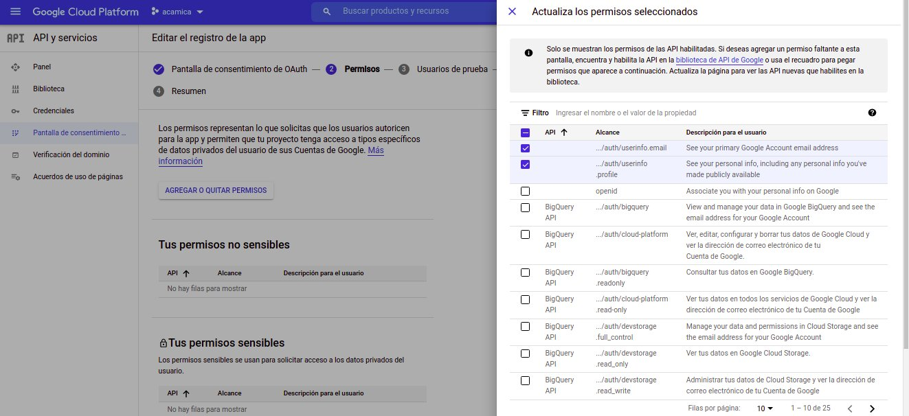
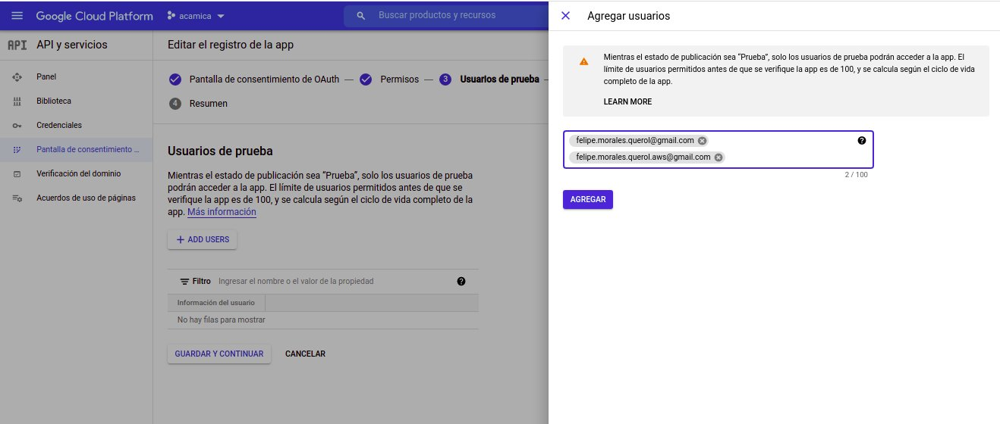

## Curso de Desarrollo Web Backend Acámica

#### Descripción

Adaptación de HTML básico para lograr auth vía Google!


#### Prerrequisitos tecnológicos:

- git (control de código fuente)
- Node.Js (server backend)
- MySQL Server Database (database)
- Redis Server (cache)

#### Entidades gestionadas:

- Usuarios


#### Módulos de Node.Js utilizados:

- "bcrypt": "^5.0.1",
- "chai": "^4.3.4",
- "dotenv": "^10.0.0",
- "express": "^4.17.1",
- "express-validator": "^6.12.2",
- "helmet": "^4.6.0",
- "jsonwebtoken": "^8.5.1",
- "mocha": "^9.1.2",
- "mongoose": "^6.0.8",
- "morgan": "^1.10.0",
- "mysql2": "^2.3.0",
- "node-fetch": "^2.6.3",
- "nodemon": "^2.0.13",
- "require-from-url": "^3.1.3",
- "sequelize": "^6.6.5",
- "swagger-jsdoc": "^6.1.0",
- "swagger-ui-express": "^4.1.6"

#### Instrucciones para gestionar auth vía Google

1. Acceder a https://console.developers.google.com/apis/credentials y acceder con un usuario de correo electrónico de Google.

2. Crear un proyecto nuevo, por ejemplo de nombre aca-dwbe-sp4-m58.

   
   Tras la creación recibirá una notificación que creada!

3. Luego configurar la pantalla de Consentimiento.

   

4. Agregar los permisos requeridos (.../aut/userinfo.email y .../auth/userinfor.profile). Tras las selección se deberá seleccionar el botón Actualizar.
   
   

5. Podemos agregar usuarios de prueba, tal como se muestra a continuación:

   

6. Con esto tenemos nuestra pantalla de consentimiento lista!

7. Luego vamos a la solapa Credenciales y vamos a Crear ID de cliente de Oauth de tipo aplicación web, y le damos el nombre del cliente. Estos son las credenciales que vamos a estar utilizando en la app.

8. Ahora pasamos a descargar la librería passport para oauth.

   ```npm install passport-google-oauth20 passport cookie-session```

9. Chequear y aplicar el código desde https://github.com/Vuka951/tutorial-code/tree/master/express-google-oauth2/done a nuestro proyecto


#### Instrucciones de instalación:

1. Crear carpeta para su instalación
2. Ingresar a la carpeta creada y desde la consola ejecutar:
   `git clone https://github.com/felipemoralesquerol/aca-dwbe-sp4-m58-evento-online`
3. Ingresar a la carpeta aca-sprint1-project.
4. Ejecutar `npm install`.
5. Copiar el archivo .env.example a .env
6. Configurar las variables de entorno del archivo .env a su configuración
7. (opcional) Ejecutar script sql ubicado en carpeta sql que contiene las sentencias de creación de base de datos y tablas.
8. Chequear las dependencias utilizadas vía `npm-check`
9. Arrancar el servidor ejecutando `npm run dev`
10. Ejecución de test ejecutando `npm run test`
11. A disfrutar!!

#### Documentación de la aplicación vía PostMan:

- Descarga y ejecuta localmente la colección https://github.com/felipemoralesquerol/aca-dwbe-sp4-m58-evento-online/blob/master/api/postman/aca-dwbe-sp4-m58-evento-online.postman_collection.json

---

_Nota del autor:
Esta implementación fue desarrollada a titulo personal y solamente a los efectos de contar con una alternativa de la posible implementación de lo requerido.
Cualquier comentario será bienvenido!_